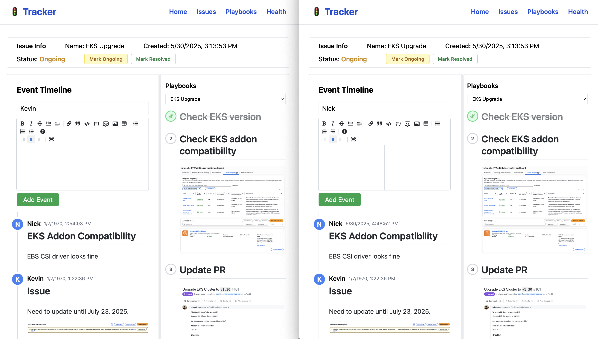

# Tracker



Tracker is real-time collaborative infrastructure event tracking system.

## Features

- Create issue on infrastructure events
- Real-time event tracking
- Playbook integration

## Setup

1. Install dependencies:
 
```bash
npm install
```

2. Start the development server:

```bash
npm run dev
```

## Roadmap

- [x] Backend Support
- [ ] Playbook creation support
- [ ] Markdown message Support
- [ ] Image embedding support
- [ ] ...
