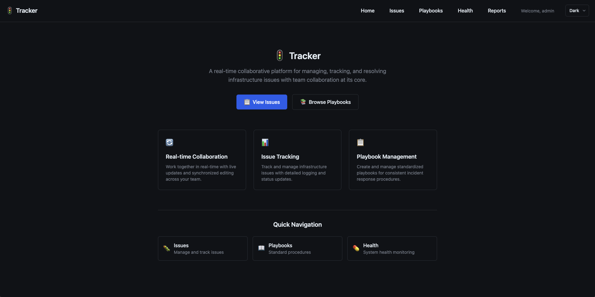

# Tracker

Tracker is real-time collaborative infrastructure event tracking system.



## Features

- Create issue on infrastructure events
- Real-time event tracking
- Playbook integration

## Development Setup

1. Setup Tracker server dependencies:

```bash
# Install Docker dependencies
docker-compose -f ./server/docker/docker-compose.yml up -d

# Install Go dependencies
go mod tidy
```

2. Then, run the Tracker server:

```bash
go run ./server/main.go
```

3. Install Tracker frontend dependencies:
 
```bash
npm install
```

4. Start the Tracker frontend development server:

```bash
npm run dev
```

## Roadmap

- [x] Real-time collaborative event feed (Yorkie integration)
- [x] Server API for issue management
- [x] Playbook creation and editing UI
- [x] Health check on infrastructure
- [x] Notification and paging system
- [x] Automatic issue creation from infrastructure events (webhooks/integrations)
- [x] Markdown support for event messages
- [x] Image embedding in event feed (MinIO/S3 integration)
- [x] Authentication with basic auth and JWT
- [x] Report creation and editing UI
- [ ] Quicklinks to access external resources at once
- [ ] Tab in issue details for information separation during the event
- [ ] LLM-powered summary: Link issues to playbooks (Ollama integration)
